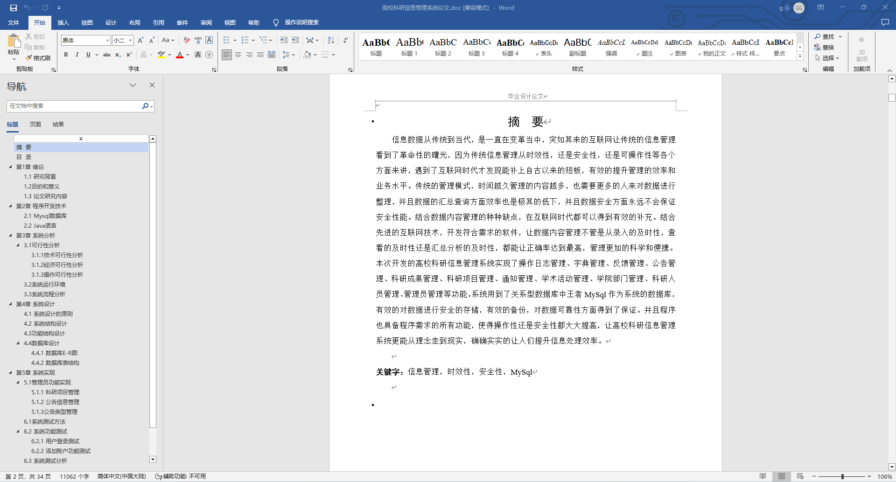
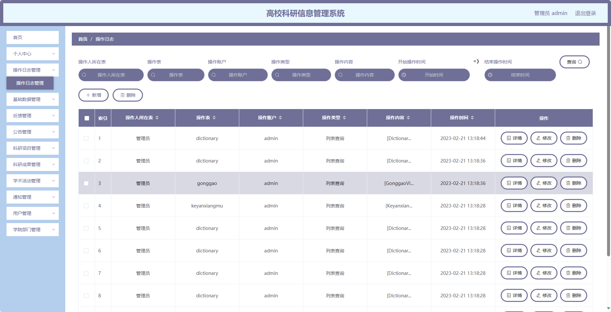
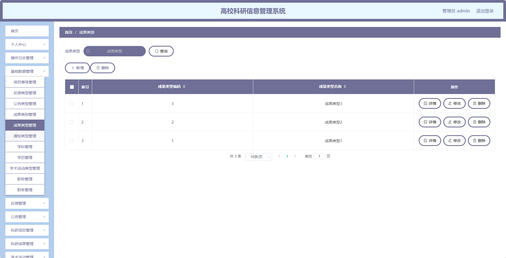
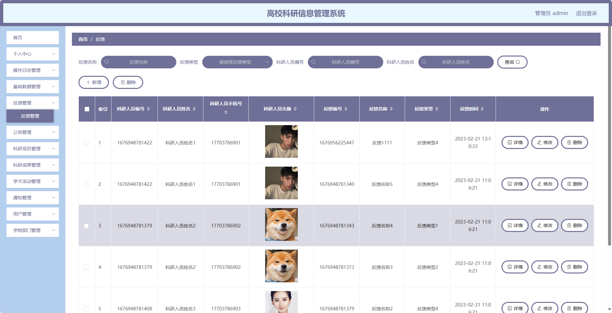
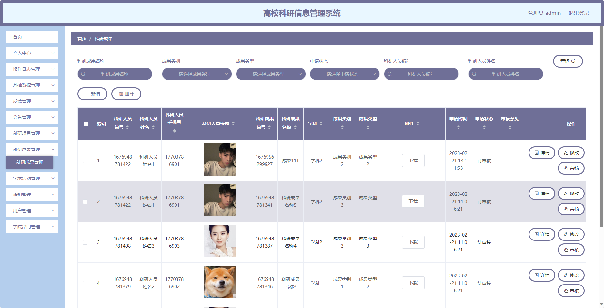
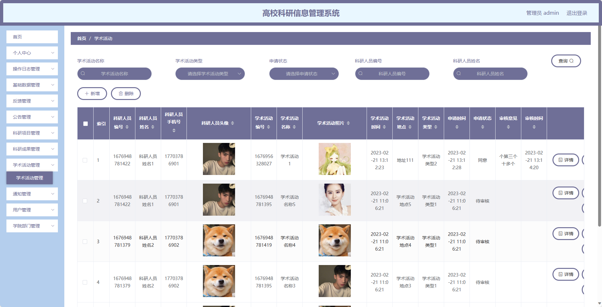
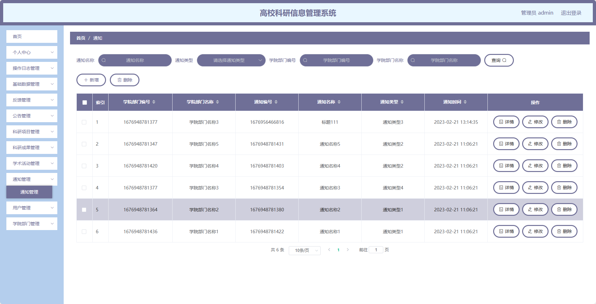
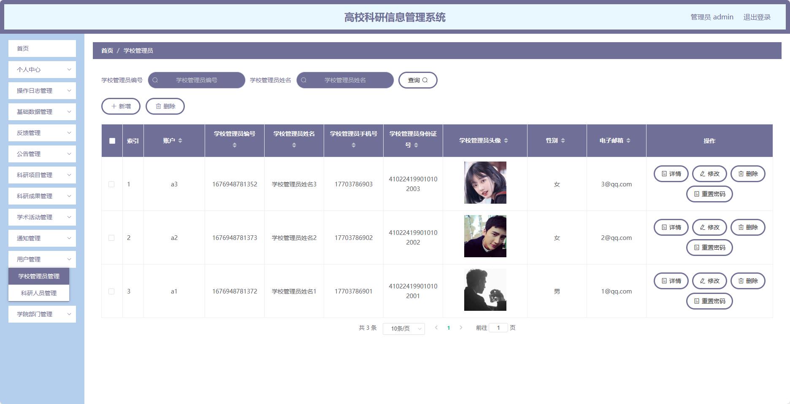
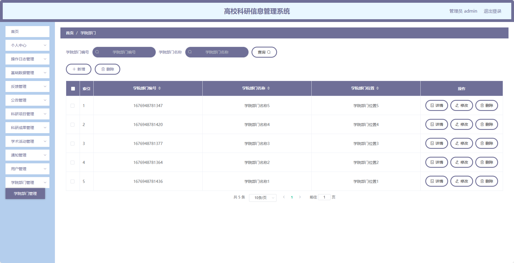

基于Springboot的高校科研信息管理系统（程序+论文）
=
### 完整代码获取地址：从戎源码网 ([https://armycodes.com/](https://armycodes.com/))
### 作者微信：19941326836  QQ：952045282 
### 承接计算机毕业设计、Java毕业设计、Python毕业设计、深度学习、机器学习
### 选题+开题报告+任务书+程序定制+安装调试+论文+答辩ppt 一条龙服务
### 所有选题地址https://github.com/nature924/allProject

一、项目介绍
---
基于Spring Boot框架实现的高校科研信息管理系统，系统包含两种角色：管理员、用户,主要功能如下。

前台：
1. 首页：展示科研相关信息和公告。
2. 反馈：用户可以提交反馈意见或问题。
3. 公告：展示学校或科研相关的公告信息。
4. 科研项目：展示科研项目的详细信息，包括项目名称、负责人等。
5. 科研成果：展示科研成果的详细信息，包括成果名称、作者等。
6. 学术活动：展示学术活动的详细信息，包括活动名称、举办时间等。
7. 通知：展示与科研相关的通知信息。
8. 用户管理：管理员可以管理用户的信息，包括添加、编辑、删除用户账号等操作。
9. 学院部门管理：管理员可以管理学院部门的信息，包括添加、编辑、删除学院部门等操作。

### 后台：
### 1. 管理员：
   - 个人中心：管理个人信息，包括修改密码、查看个人资料等。
   - 操作日志管理：记录管理员的操作日志。
   - 基础数据管理：管理系统的基础数据，包括项目等级、反馈类型、公告类型等的添加、编辑、删除等操作。
   - 反馈管理：管理用户的反馈信息，包括查看、回复反馈等操作。
   - 公告管理：管理公告的发布和编辑等操作。
   - 科研项目管理：管理科研项目的信息，包括添加、编辑、删除科研项目等操作。
   - 科研成果管理：管理科研成果的信息，包括添加、编辑、删除科研成果等操作。
   - 学术活动管理：管理学术活动的信息，包括添加、编辑、删除学术活动等操作。
   - 通知管理：管理与科研相关的通知信息，包括添加、编辑、删除通知等操作。
   - 用户管理：管理用户的信息，包括添加、编辑、删除用户账号等操作。
   - 学院部门管理：管理学院部门的信息，包括添加、编辑、删除学院部门等操作。

### 2. 学校管理员：
   - 个人中心：管理个人信息，包括修改密码、查看个人资料等。
   - 反馈管理：管理用户的反馈信息，包括查看、回复反馈等操作。
   - 公告管理：管理公告的发布和编辑等操作。
   - 科研项目管理：管理科研项目的信息，包括添加、编辑、删除科研项目等操作。
   - 科研成果管理：管理科研成果的信息，包括添加、编辑、删除科研成果等操作。
   - 学术活动管理：管理学术活动的信息，包括添加、编辑、删除学术活动等操作。
   - 通知管理：管理与科研相关的通知信息，包括添加、编辑、删除通知等操作。
   - 用户管理：管理用户的信息，包括添加、编辑、删除用户账号等操作。
   - 学院部门管理：管理学院部门的信息，包括添加、编辑、删除学院部门等操作。

### 3. 科研人员：
   - 个人中心：管理个人信息，包括修改密码、查看个人资料等。
   - 反馈管理：管理用户的反馈信息，包括查看、回复反馈等操作。
   - 公告管理：管理公告的发布和编辑等操作。
   - 科研项目管理：管理科研项目的信息，包括添加、编辑、删除科研项目等操作。
   - 科研成果管理：管理科研成果的信息，包括添加、编辑、删除科研成果等操作。
   - 学术活动管理：管理学术活动的信息，包括添加、编辑、删除学术活动等操作。
   - 通知管理：管理与科研相关的通知信息，包括添加、编辑、删除通知等操作。
   - 学院部门管理：管理学院部门的信息，包括添加、编辑、删除学院部门等操作。

二、项目技术
---
- 编程语言：Java
- 数据库：MySQL
- 项目管理工具：Maven
- 前端技术：VUE、HTML、Jquery、Bootstrap
- 后端技术：Spring、SpringMVC、MyBatis

三、运行环境
---
- 操作系统：Windows、macOS都可以
- JDK版本：JDK1.8以上都可以
- 开发工具：IDEA、Ecplise、Myecplise都可以
- 数据库: MySQL5.7以上都可以
- Tomcat：任意版本都可以
- Maven：任意版本都可以

四、运行截图
---
### 论文截图：

### 程序截图：

